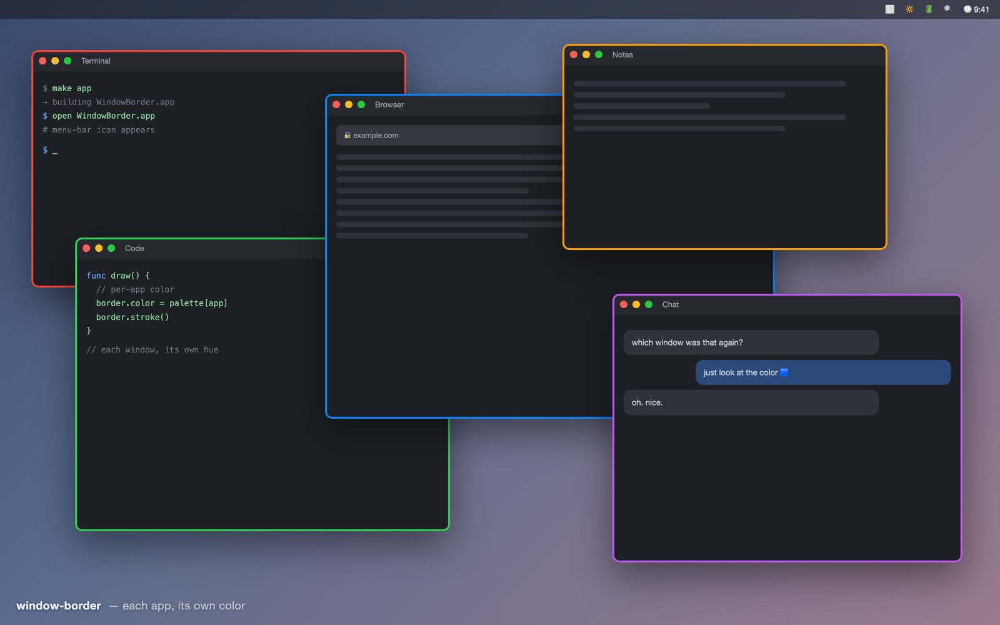

# window-border



A tiny macOS menu-bar app that draws a **colored outline around every window**,
with **one stable color per app** — so when you have a dozen windows open you can
tell at a glance which is which.

It reads only each window's position and owning app, so it needs **no screen
recording permission**. The outlines are transparent and click-through, and each
one is layered just above its own window, so they don't get in your way.

## Build

```sh
make app
```

Requires the Xcode Command Line Tools (`clang`). macOS 12+.

## Run

```sh
open WindowBorder.app
```

> If you got a prebuilt copy instead of building it yourself, it's unsigned, so
> macOS Gatekeeper may refuse to open it on first launch. Either right-click the
> app and choose **Open**, or clear the quarantine flag:
> `xattr -dr com.apple.quarantine WindowBorder.app`. Building from source (above)
> avoids this entirely.

It lives in the menu bar (look for the ⬜ icon). Open windows get an outline; the
color is assigned per app and stays consistent. Move or resize a window and its
outline follows.

From the menu bar icon:

- **Borders On/Off** — toggle the outlines
- **Reload Colors** — re-read your color config
- **Quit**

## Choosing your own colors (optional)

By default each app gets the next color from a built-in palette. To pin specific
apps to specific colors, create `~/.config/window-border/colors.json`:

```json
{
  "Safari": "#1E90FF",
  "Finder": "#FF3B30",
  "Terminal": "#34C759",
  "Code": "#AF52DE",
  "Google Chrome": "#FFCC00"
}
```

Keys are the app names as macOS reports them; values are hex colors. Then pick
**Reload Colors** from the menu. Apps not listed keep getting palette colors.

## How it works

- `CGWindowList` gives the on-screen windows, their bounds, and owning app.
- For each window we keep a transparent, click-through overlay window the same
  size, drawing a rounded-rect stroke in the app's color.
- Each overlay is ordered just above its target window, so the borders layer the
  same way your windows do.
- A light timer (~20 Hz) keeps the outlines following moves and resizes.

## Limitations

- The outline tracks via polling, so during a fast drag it can lag a frame.
- Multi-display setups use the primary display as the coordinate reference;
  edge cases on mixed-resolution layouts are possible.
- It draws around normal app windows only (not menus, panels, or the desktop).

## License

MIT
